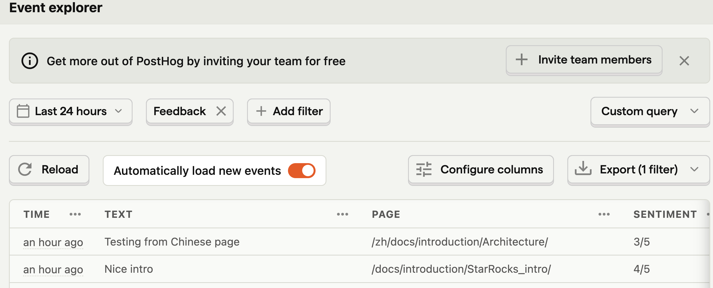

# docusaurusFeedbackWidget

I tried Google Analytics (GA4), Plausible, and PostHog. My preferences are
based on my experience:

- I don't know anything about using tracking information for marketing
- I like simple things to be simple
- I prefer to grab data from the datastore with an API call over looking at a report on a website

I could not view my data easily with GA4 or Plausible (remember, I don't do marketing, and these are tools
aimed at marketing analysts).  I tried using the Plausible API, but could not retrieve multiple properties.

> Note
>
> I am outside of my area, I don't know these tools and I don't want to invest too much time if I can avoid it. I would love it if people who know Plausible or GA4 could chime in and help make getting the reader feedback into a simple format for us to use, as I am sure there is a case to be made for having the data in common marketing tools.

With PostHog I sent my event, it popped up in the event list, and I selected the checkbox to **Hide PostHog properties** leaving me with a display of the properties that I sent. Hint, the filters and columns get added to the URL, so bookmark it when you see what you want. For example `https://us.posthog.com/events#q=%7B%22kind%22%3A%22DataTableNode%22%2C%22full%22%3Atrue%2C%22source%22%3A%7B%22kind%22%3A%22EventsQuery%22%2C%22select%22%3A%5B%22timestamp%22%2C%22properties.text%22%2C%22properties.page%22%2C%22properties.sentiment%22%5D%2C%22orderBy%22%3A%5B%22timestamp%20DESC%22%5D%2C%22after%22%3A%22-24h%22%2C%22event%22%3A%22Feedback%22%7D%2C%22propertiesViaUrl%22%3Atrue%2C%22showSavedQueries%22%3Atrue%2C%22showPersistentColumnConfigurator%22%3Atrue%7D`



As far as extracting data, once the filters, column selection, etc. are setup in the browser there is a button to export the SQL, so:

```sql
SELECT timestamp, properties.text, properties.page, properties.sentiment \
FROM events \
WHERE and(equals(event, 'Feedback'), less(timestamp, toDateTime('2024-01-11 00:39:13.382813')), greater(timestamp, toDateTime('2024-01-10 00:39:08.383129'))) \
ORDER BY timestamp DESC LIMIT 101 OFFSET 0
```

## PostHog

- Sign up for a PostHog account, I am on the free tier
- `yarn add posthog-js`

At this point you can get all of the normal page views, button clicks, etc. recorded in PostHog. I have the `automatic events` turned off in the `Feedback.tsx` component, as we get pageviews from another tool. The `Feedback.tsx` uses `posthog-js` to post the custom event `Feedback`.

In the `Feedback.tsx` component PostHog is imported:

```js
import posthog from 'posthog-js'
```

and then on submission of the Feedback form PostHog is initialized, and an event is sent with `posthog.capture`:

```js
posthog.init('phc_Krs7r8xNYU3OeIItMy5lOoPcTnxJmrX5zYn5JMp2izy', {
    api_host: 'https://app.posthog.com',
    autocapture: false,
})

posthog.capture('Feedback', {sentiment: rating + '/5', page: window.location.pathname, text: notes});
```

## Sign up for Plausible, or host your own.

## Create a new docusaurus classic

## Grab the Feedback component from Hasura

## Add scss support to Docusaurus

## Swizzle the DocItem Footer (eject)

## Add the Feedback component to Footer

## Edit the Feedback component to remove Segment and add Pausible

## Create a `Feedback` "Goal" in Plausible

## Create "Custom Properties" in Plausible

- text
- page
- sentiment

